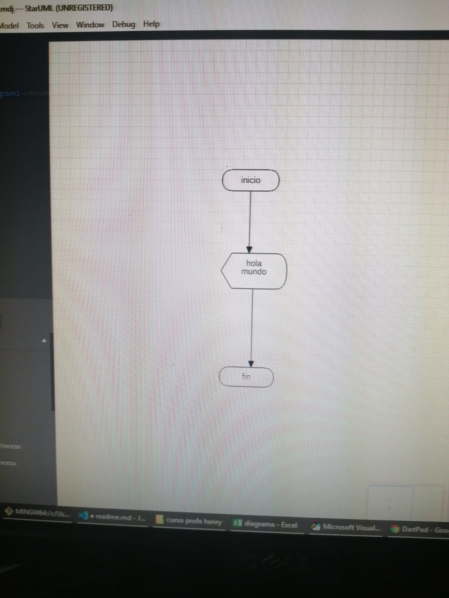

# Septiembre 2 de 2021

En esta clase el instructor hablo de las diferentes variables como staruml, excel, atom y dar

## Ejercicio en excel

``
Sub inicio()
    MsgBox "hola peña"
    MsgBox "espero estes bien"
    MsgBox "hasta luego"
End Sub
``

## Ejercicio en darpad

``
void main() {
  print ( hola mundo );
  
}
``

## Ejercicio staruml

